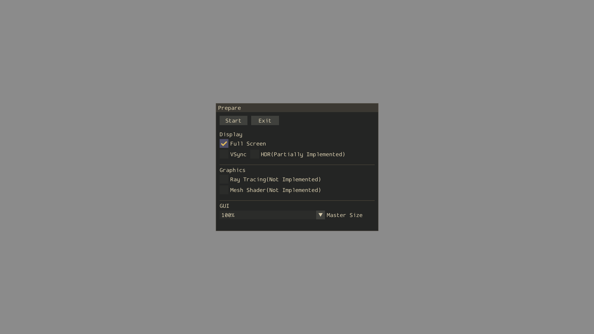
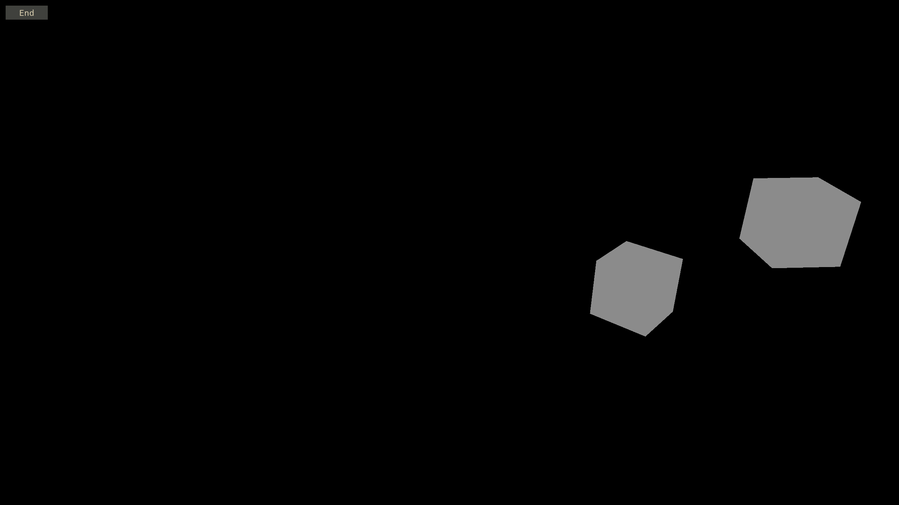

# PodoNatureEngine
HLSL, D3D12, Win32, C++을 이용하여 구현 중인 실시간 3D 벤치마크 워크로드 엔진입니다.

오픈 월드 자연환경 워크로드의 특성을 분석하고 최적화하는 것을 목표로 합니다.

현재 기초적인 조명 렌더링 기능을 구현하고 있습니다.

 

<!---------------------------------------------------------------------------------------------------------------------------------------------->
## 목차
- [1. 스크린샷](#1-스크린샷)
- [2. 실행 방법](#2-실행-방법)
- [3. 주요 기능](#3-주요-기능)
- [4. 성능 측정](#4-성능-측정)
- [5. 구현 제외](#5-구현-제외)
- [6. 외부 항목](#6-외부-항목)
- [7. 구현 참고](#7-구현-참고)

 

<!---------------------------------------------------------------------------------------------------------------------------------------------->
## 1. 스크린샷
[준비]

[실행]

 

<!---------------------------------------------------------------------------------------------------------------------------------------------->
## 2. 실행 방법
### 2.1. 최소 사양
|구분           |최소 사양                            |
|---------------|-------------------------------------|
|운영체제       |Windows 10 22H2 64-bit 이상          |
|GPU 피처 레벨  |D3D_FEATURE_LEVEL_12_0 이상          |
|GPU 셰이더 모델|Shader Model 6.6 이상                |

- 추후 바인드리스 서술자 힙 접근을 사용할 것을 고려하여 Shader Model 6.6을 최소 사양으로 정하였습니다. 운영체제는 지원 범위를 단순화하기 위해 Windows 10의 마지막 기능 업데이트인 22H2를 최소 지원 버전으로 정하였습니다.

 

### 2.2. 빌드 방법
1. 리포지토리를 다운로드합니다.

2. 다운로드한 리포지토리에 포함된 `PodoNatureEngine.slnx` 솔루션 파일을 더블 클릭합니다.

3. Visual Studio 상단의 구성을 `Release`로, 플랫폼을 `x64`로 설정합니다.  

4. Visual Studio 상단에서 `빌드(B)`의 `솔루션 빌드(Ctrl+Shift+B)`를 누릅니다.

5. `OutDir/PodoNatureEngineRelease64.exe` 이름의 파일이 생성되었다면 빌드에 성공한 것입니다.

 

### 2.3. 실행 방법
1. 위 빌드 과정을 통해 생성한 `OutDir/PodoNatureEngineRelease64.exe`를 더블 클릭하여 실행합니다.

2. 시작 전 옵션을 설정할 수 있는 준비 화면이 나타납니다. `Start` 버튼을 눌러 시작합니다.

3. 시간에 따라 진동하는 두 개의 정육면체가 화면에 나타납니다.
  
4. 왼쪽 상단의 `End` 버튼을 누르면 다시 준비 화면으로 돌아갑니다.

5. 종료하고 싶으면 준비 화면의 `Exit` 버튼을 누르거나 `ALT+F4` 단축키를 누르면 됩니다.

 

<!---------------------------------------------------------------------------------------------------------------------------------------------->
## 3. 주요 기능
### 3.1. 조형 기능
정육면체 두 개를 시간에 따라 진동시키고 있습니다.

 

### 3.2. 조명 기능
현재 조명 연산은 구현되어 있지 않으며, 픽셀 셰이더에서 고정된 색상을 출력하고 있습니다.

 

### 3.3. 조작 기능
|입력               |기능                             |
|-------------------|---------------------------------|
|키보드 `ESC`       |실행 상태에서 준비 상태로 복귀   |
|키보드 `ALT+ENTER` |화면 모드 전환                   |

- 일관된 성능 측정을 위해 고정된 카메라 애니메이션만을 제공할 예정입니다.

 

### 3.4. 옵션 기능
|옵션                   |설정값                                       |
|-----------------------|---------------------------------------------|
|화면 모드              |`창 모드` or `테두리 없는 창 모드`           |
|VSync                  |`Off` or `On`                                |
|Tearing                |피처 지원 여부와 VSync 여부에 따라 자동 적용 |
|HDR                    |`Off` or `On`                                |
|GUI 크기               |`50%` or `75%` or `100%` or `125%` or `150%` |

- 옵션은 `OutDir/SavedSettings.txt` 파일에 저장되며, 다음 실행 시 복원됩니다.

 

<!---------------------------------------------------------------------------------------------------------------------------------------------->
## 4. 성능 측정
### 4.1. 측정 환경
|환경 요소          |세부 정보                                                        |
|-------------------|-----------------------------------------------------------------|    
|CPU                |i5-13600KF, 3500 MHz, 14 코어, 20 논리 프로세서                  |
|GPU                |INNO3D GeForce RTX 4070 Ti D6X 12GB X3                           |
|Display            |Samsung Odyssey G6 LS32BG650 QHD 240 Hz                          |
|RAM                |32 GB, DDR4, 3600 Hz                                             |
|OS                 |Windows 11, 버전 25H2, 빌드 26200.8973                           |
|플랫폼 도구 집합   |v145 for Microsoft C++ Build Tools                               |
|컴파일러 버전      |x86용 Microsoft (R) C/C++ 최적화 컴파일러 버전 19.51.36252       |
|구성               |`Profile` (= 기본 `Release` 구성 + `USE_PIX` 전처리기 상수 정의) |

 

### 4.2. 측정 방법
1. 빌드 구성을 `Profile`로 설정한 뒤 빌드를 수행하여 `OutDir/PodoNatureEngineProfile64.exe` 실행 파일을 생성합니다.
   
2. 생성된 `OutDir/PodoNatureEngineProfile64.exe` 파일을 우클릭한 뒤 관리자 권한으로 실행합니다.  
  (만일 관리자 권한으로 실행하지 않을시 PIX 측정을 시작할 수 없어, 이후 `Start` 버튼을 누르는 과정에서 오류가 발생합니다.)

3. 준비 화면에서 측정 옵션을 설정합니다. 화면 모드는 전체 화면으로 설정하고, 먼저 VSync는 비활성화합니다.
  
4. `Start` 버튼을 누르면 PIX의 Sequential Timing Capture가 자동으로 시작됩니다.

5. 측정하고 싶은 구간이 끝나면 `End` 버튼을 눌러 캡처를 종료합니다.

6. 생성된 측정 결과 파일인 `OutDir/PodoNatureEngineProfile.wpix`을 더블 클릭하여 PIX에서 엽니다.

7. `Metrics` 탭을 통해 각 이벤트의 소요 시간을 분석합니다.  
  (만일 분석 이벤트가 표시되지 않을 경우, 우측의 `PIX CPU Events`와 `PIX GPU Events`의 항목을 활성화합니다.)

8. 다시 3번 단계로 돌아가 VSync를 활성화한 뒤, 동일한 절차로 측정 및 분석을 수행합니다.

 

### 4.3. 측정 결과
[VSync Off]
|구분 |측정 구간                                                                  |평균 소요 시간 |
|-----|---------------------------------------------------------------------------|--------------:|
|CPU  |1. 프레임 시간                                                             |352,561 ns     |
|     |├─ 2. GPU 명령 완료 대기                                                   |64,259 ns      |
|     |├─ 3. 논-렌더 로직                                                         |4,341 ns       |
|     |└─ 4. 렌더 로직                                                            |283,708 ns     |
|     |&nbsp;&nbsp;&nbsp;&nbsp;&nbsp;&nbsp;&nbsp;&nbsp;├─ 5. 커맨드 리스트 초기화 |8,724 ns       |
|     |&nbsp;&nbsp;&nbsp;&nbsp;&nbsp;&nbsp;&nbsp;&nbsp;├─ 6. 자원 바인딩          |8,784 ns       |
|     |&nbsp;&nbsp;&nbsp;&nbsp;&nbsp;&nbsp;&nbsp;&nbsp;├─ 7. 씬 그리기            |3,363 ns       |
|     |&nbsp;&nbsp;&nbsp;&nbsp;&nbsp;&nbsp;&nbsp;&nbsp;├─ 8. GUI 그리기           |10,423 ns      |
|     |&nbsp;&nbsp;&nbsp;&nbsp;&nbsp;&nbsp;&nbsp;&nbsp;├─ 9. 자원 언바인딩        |1,477 ns       |
|     |&nbsp;&nbsp;&nbsp;&nbsp;&nbsp;&nbsp;&nbsp;&nbsp;├─ 10. 커맨드 리스트 제출  |64,689 ns      |
|     |&nbsp;&nbsp;&nbsp;&nbsp;&nbsp;&nbsp;&nbsp;&nbsp;└─ 11. 제시                |185,554 ns     |
|GPU  |1. 프레임 시간                                                             |23,063 ns      |
|     |├─ 2. 자원 바인딩                                                          |21,872 ns      |
|     |├─ 3. 씬 그리기                                                            |1,039 ns       |
|     |├─ 4. GUI 그리기                                                           |96 ns          |
|     |└─ 5. 자원 언바인딩                                                        |9 ns           |

- 총 캡처 시간: 11,140.10 ms

- GPU 명령이 모두 소진될 때까지 CPU를 대기시키는 현 로직으로 인해, '2. GPU 명령 완료 대기' 과정에서 CPU 프레임 시간의 약 20%가 대기 상태로 낭비되고 있습니다.

- '11. 제시' 과정은 현재 CPU 프레임 시간의 약 절반을 차지하고 있지만, 렌더링 워크로드가 무거워지면 고정적인 제시 과정의 비중은 감소할 것으로 예상합니다.

- 측정 결과 파일에 담긴 그래프 분포를 살펴본 결과, 특이하게 GPU의 '2. 자원 바인딩' 과정이 측정 시작 후 2.5초 시점에 소요 시간이 절반 이하로(약 60,000 ns -> 20,000 ns) 줄어들며 히스토그램 분포가 양분됨을 발견하였습니다. 이는 아래 VSync를 킨 경우에도 비슷한 양상 나타났지만, 원인은 파악하지 못하였습니다. 

 

[VSync On]  
|구분 |측정 구간                                                                  |평균 소요 시간 |
|-----|---------------------------------------------------------------------------|--------------:|
|CPU  |1. 프레임 시간                                                             |4,156,566 ns   |
|     |├─ 2. GPU 명령 완료 대기                                                   |3,664,646 ns   |
|     |├─ 3. 논-렌더 로직                                                         |8,592 ns       |
|     |└─ 4. 렌더 로직                                                            |482,635 ns     |
|     |&nbsp;&nbsp;&nbsp;&nbsp;&nbsp;&nbsp;&nbsp;&nbsp;├─ 5. 커맨드 리스트 초기화 |21,004 ns      |
|     |&nbsp;&nbsp;&nbsp;&nbsp;&nbsp;&nbsp;&nbsp;&nbsp;├─ 6. 자원 바인딩          |20,221 ns      |
|     |&nbsp;&nbsp;&nbsp;&nbsp;&nbsp;&nbsp;&nbsp;&nbsp;├─ 7. 씬 그리기            |7,155 ns       |
|     |&nbsp;&nbsp;&nbsp;&nbsp;&nbsp;&nbsp;&nbsp;&nbsp;├─ 8. GUI 그리기           |24,406 ns      |
|     |&nbsp;&nbsp;&nbsp;&nbsp;&nbsp;&nbsp;&nbsp;&nbsp;├─ 9. 자원 언바인딩        |3,295 ns       |
|     |&nbsp;&nbsp;&nbsp;&nbsp;&nbsp;&nbsp;&nbsp;&nbsp;├─ 10. 커맨드 리스트 제출  |114,985 ns     |
|     |&nbsp;&nbsp;&nbsp;&nbsp;&nbsp;&nbsp;&nbsp;&nbsp;└─ 11. 제시                |290,559 ns     |
|GPU  |1. 프레임 시간                                                             |63,925 ns      |
|     |├─ 2. 자원 바인딩                                                          |60,306 ns      |
|     |├─ 3. 씬 그리기                                                            |3,126 ns       |
|     |├─ 4. GUI 그리기                                                           |427 ns         |
|     |└─ 5. 자원 언바인딩                                                        |8 ns           |

- 총 캡처 시간: 11,452.36 ms

- VSync를 켰으므로 명령 큐에 제출된 Present 명령은 VSyncBlank 타이밍에 처리되고, 이 시점까지 `FlushCommandQueue()`가 CPU의 다음 프레임 렌더 시작을 블록하므로, CPU의 '2. GPU 명령 완료 대기' 시간이 늘어납니다.

- 측정 환경의 모니터 주사율은 240Hz이므로 주기는 $\frac{1}{240\ \mathrm{Hz}} \approx 4.17\ \mathrm{ms}$이고 이는 CPU의 "프레임 시간" 측정값과 거의 맞아떨어집니다.

- VSync에 직접적인 영향을 받지 않는 일부 구간의 시간 소요가 2배 이상 늘어난 이유는, VSync에 의한 유휴 시간이 증가하며 CPU와 GPU의 스케줄링이나 클럭이 영향을 받았을 가능성을 생각할 수 있으나, 현재 측정만으로는 특정할 수 없습니다.

 

<!---------------------------------------------------------------------------------------------------------------------------------------------->
## 5. 구현 제외
- **디바이스 소실 감지**  
  디바이스 소실을 감지하는 로직은 구현을 단순화하기 위해 작성하지 않았습니다.

 

- **윈도우 DPI 설정값 자동 반영**  
  본 엔진은 DPI 설정값에 의한 윈도우의 자동 스케일링으로 화면이 훼손되지 않도록 DPI AWARENESS를 매니페스트에 명시하였습니다. 윈도우의 DPI 설정값은 GUI 크기에 반영하지 않고, 대신 옵션에서 GUI의 배율을 50%, 75%, 100%, 125%, 150% 중에서 선택할 수 있도록 간단히 구현하였습니다.

 

<!---------------------------------------------------------------------------------------------------------------------------------------------->
## 6. 외부 항목
개발 및 빌드를 위해 다음 외부 SDK, 라이브러리, 툴킷을 사용합니다.

 

### 6.1. DirectX 12 Agility SDK
- 목적
  - 윈도우 업데이트와 상관없이 최신 D3D12 헤더, 런타임 사용

- 사용 방식
  - NuGet 패키지 관리 (Microsoft.Direct3D.D3D12)
  
- 복원 위치
  - `PodoNatureEngine\packages\Microsoft.Direct3D.D3D12.<버전명>`

- 라이선스 종류
  - MICROSOFT SOFTWARE LICENSE
  - MIT License

- 라이선스 위치
  - `PodoNatureEngine\packages\Microsoft.Direct3D.D3D12.<버전명>\LICENSE.txt`
  - `PodoNatureEngine\packages\Microsoft.Direct3D.D3D12.<버전명>\LICENSE-CODE.txt`

 

### 6.2. DirectX Tool Kit (DirectXTK12)
- 목적
  - Direct3D 12 유틸리티 라이브러리 사용

- 사용 방식
  - NuGet 패키지 관리 (directxtk12_desktop_win10)

- 복원 위치
  - `PodoNatureEngine\packages\directxtk12_desktop_win10.<버전명>`

- 라이선스 종류
  - MIT License

- 라이선스 위치
  - `PodoNatureEngine\packages\directxtk12_desktop_win10.<버전명>\docs\README.md` 내부 간접 링크
  - `https://github.com/microsoft/DirectXTK12/blob/main/LICENSE`

 

### 6.3. PIX Event Runtime
- 목적
  - PIX 캡처

- 사용 방식
  - NuGet 패키지 관리 (WinPixEventRuntime)
  
- 복원 위치
  - `PodoNatureEngine\packages\WinPixEventRuntime.<버전명>`

- 라이선스 종류
  - MIT License

- 라이선스 위치
  - `PodoNatureEngine\packages\WinPixEventRuntime.<버전명>\license.txt`

 

### 6.4 Dear ImGui
- 목적
  - 옵션 GUI 제공

- 사용 방식
  - 리포지토리 내부에 직접 포함함(`PodoNatureEngine\External\imgui`)
  - 예제 코드의 일부를 수정하여 사용함(`PodoNatureEngine\Code\Header\Alloc.h`)

- 원본 리포지토리
  - ocornut/imgui  
    `https://github.com/ocornut/imgui`

- 라이선스 종류
  - MIT License

- 라이선스 위치
  - `PodoNatureEngine\External\imgui\LICENSE.txt`

 

<!---------------------------------------------------------------------------------------------------------------------------------------------->
## 7. 구현 참고
"Introduction To 3D Game Programming With DirectX 12 Second Edition" (Frank D. Luna 지음 / Mercury Learning And Information 출판 / 2025년 발행) 

"Get Started with Win32 and C++" (Microsoft Learn / 2026년 6월 열람)  
[https://learn.microsoft.com/en-us/windows/win32/learnwin32/learn-to-program-for-windows](https://learn.microsoft.com/en-us/windows/win32/learnwin32/learn-to-program-for-windows)

"Link an executable to a DLL" (Microsoft Learn / 2026년 7월 열람)  
[https://learn.microsoft.com/en-us/cpp/build/linking-an-executable-to-a-dll?view=msvc-170](https://learn.microsoft.com/en-us/cpp/build/linking-an-executable-to-a-dll?view=msvc-170)

"Getting Started with the Agility SDK" (Microsoft Dev Blogs / 2026년 7월 열람)  
[https://devblogs.microsoft.com/directx/gettingstarted-dx12agility](https://devblogs.microsoft.com/directx/gettingstarted-dx12agility)

"Setting the default DPI awareness for a process" (Microsoft Learn / 2026년 7월 열람)  
[https://learn.microsoft.com/en-us/windows/win32/hidpi/setting-the-default-dpi-awareness-for-a-process](https://learn.microsoft.com/en-us/windows/win32/hidpi/setting-the-default-dpi-awareness-for-a-process)

"ComPtr" (Microsoft / 2026년 7월 열람)  
[https://github.com/Microsoft/DirectXTK/wiki/ComPtr](https://github.com/Microsoft/DirectXTK/wiki/ComPtr)

"The Care and Feeding of Modern Swap Chains" (Chuck Walbourn / 2026년 7월 열람)  
[https://walbourn.github.io/care-and-feeding-of-modern-swapchains](https://walbourn.github.io/care-and-feeding-of-modern-swapchains)  
[https://walbourn.github.io/care-and-feeding-of-modern-swap-chains-2](https://walbourn.github.io/care-and-feeding-of-modern-swap-chains-2)  
[https://walbourn.github.io/care-and-feeding-of-modern-swap-chains-3](https://walbourn.github.io/care-and-feeding-of-modern-swap-chains-3)

"PresentMon" (GameTechDev / 2026년 7월 열람)  
[https://github.com/GameTechDev/PresentMon](https://github.com/GameTechDev/PresentMon)

"WinPixEventRuntime" (Microsoft Dev Blogs / 2026년 7월 열람)  
[https://devblogs.microsoft.com/pix/winpixeventruntime](https://devblogs.microsoft.com/pix/winpixeventruntime)

"Programmatic Timing Captures now available" (Microsoft Dev Blogs / 2026년 9월 열람)  
[https://devblogs.microsoft.com/pix/programmatic-timing-captures-now-available](https://devblogs.microsoft.com/pix/programmatic-timing-captures-now-available)

 